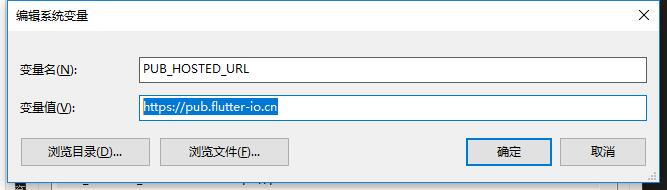

# 基础

欢迎学习dart相关教程，本指南会介绍如何安装dart sdk 并学习dart 语言， 本教程不包含移动端 flutter内容。

## 安装SDK

在你准备好创建一个应用程序时， 请获对应于应用类型的SDK和工具。

应用类型|使用说明|工具信息
--|--|--
移动端|[安装 Flutter](https://flutter.io/)|[Flutter 工具](https://flutter.io/docs/development/tools/android-studio)
Web|[安装 Dart SDK](./install)| Dart Web 端工具
脚本或服务器|[安装 Dart SDK](./install)| 服务端开发工具

- [Windows安装步骤](./install.html#windows安装步骤)
- [Linux安装步骤](./install.html#linux安装步骤)
- [Mac安装步骤](./install.html#mac安装步骤)

## Windows安装步骤

选择以下选项之一进行安装：
- [使用Chocolatey](./install.html#使用chocolatey安装)
- [使用windows安装包](./install.html#使用windows安装包)

### 使用Chocolatey安装

使用[Chocolatey](https://chocolatey.org/)安装Dart SDK 的稳定版本

:::warning 注意
要使用Chocolatey安装必须先安装Chocolatey命令行工具
- [Chocolatey官网](https://chocolatey.org/)
- [Chocolatey安装教程](https://chocolatey.org/install)
:::

请运行以下命令：

```bash
C:\> choco install dart-sdk
```

要安装dev版本，请运行以下命令：
```bash
C:\> choco install dart-sdk --pre
```
要升级 Dart SDK，请运行此命令（添加--pre以升级dev版本）：
```bash
C:\> choco upgrade dart-sdk
```

### 使用windows安装包

使用适用于Windows的社区支持的 Dart SDK安装程序。 您可以使用该向导安装Dart SDK的稳定版或 开发版。[最新版本下载地址](https://github.com/GeKorm/dart-windows/releases/latest)

文件名称|描述
--|--
Dart_32.dev.setup.exe| 32位开发版本
Dart_32.stable.setup.exe| 32位稳定版本
Dart_x64.dev.setup.exe| 64位开发版本
Dart_x64.stable.setup.exe| 64位稳定版本


如果要更新dart sdk 版本，请运行dart安装目录下的 Dart Update.exe

## Linux安装步骤

如果您在AMD64（64-bit Intel）上使用Debian / Ubuntu，则可以选择以下选项之一，这两个选项都可以在发布新版本时自动更新SDK。

- [使用apt-get](./install.html#使用-apt-get)
- [使用Debian package](./install.html#安装debian软件包)

### 使用 apt-get

执行以下命令：

```bash
$ sudo apt-get update
$ sudo apt-get install apt-transport-https
$ sudo sh -c 'curl https://dl-ssl.google.com/linux/linux_signing_key.pub | apt-key add -'
$ sudo sh -c 'curl https://storage.googleapis.com/download.dartlang.org/linux/debian/dart_stable.list > /etc/apt/sources.list.d/dart_stable.list'
```

然后安装 Dart SDK 的 稳定版本：

```bash
$ sudo apt-get update
$ sudo apt-get install dart
```

或者，要安装 Dart SDK 的 开发版，请运行安装命令，然后执行以下操作：

```bash
$ sudo sh -c 'curl https://storage.googleapis.com/download.dartlang.org/linux/debian/dart_unstable.list > /etc/apt/sources.list.d/dart_unstable.list'
$ sudo apt-get update
$ sudo apt-get install dart
```
### 安装Debian软件包

以.deb包格式下载Dart SDK作为Debian软件包。
- [稳定版本2.1.0](https://storage.googleapis.com/dart-archive/channels/stable/release/latest/linux_packages/dart_2.1.0-1_amd64.deb)

- [开发版本2.1.0](https://storage.googleapis.com/dart-archive/channels/dev/release/latest/linux_packages/dart_2.1.1-dev.3.2-1_amd64.deb)

安装SDK后，将其bin目录添加到PATH。例如，使用以下命令更改活动终端会话中的PATH：
添加环境变量：
```bash
export PATH="$PATH:/usr/lib/dart/bin"
```
要更改终端会话的PATH，请使用如下命令：
```bash
$ echo 'export PATH="$PATH:/usr/lib/dart/bin"' >> ~/.profile
```

## Mac安装步骤
:::warning 注意
使用Mac须要使用[homebrew](http://brew.sh/)命令行工具安装 dart sdk，你需要先安装[homebrew](http://brew.sh/)
:::
安装[homebrew](http://brew.sh/),然后运行：

```bash
$ brew tap dart-lang/dart
$ brew install dart
```
要安装dev开发版本，请使用--devel：
```bash
$  brew install dart --devel
```
### 升级
要在新版本的Dart可用时升级，请运行：
```bash
$ brew upgrade dart
```
要在开发人员当前处于活动状态时安装稳定版本，请运行：
```bash
$ brew unlink dart
$ brew install dart
```
要在稳定版本当前处于活动状态时升级到dev开发版本，请运行：
```bash
$ brew upgrade dart --devel --force
```
### 切换发布

要在本地安装的dart版本之间切换运行 `brew switch dart <version>`。例：

```bash
$ brew switch dart 1.24.3
$ brew switch dart 2.1.0
```

如果您不确定已安装哪个版本的dart，请运行：

```bash
$ brew info dart
```
命令输出在顶部列出最新的stable和dev版本，然后是本地安装的版本。

## pub 下载镜像环境变量设置

由于pub下载第三方package镜像在谷歌的服务器，国内下载不了，设置以下环境变量可以加速package的下载速度：

```
PUB_HOSTED_URL https://pub.flutter-io.cn
```



