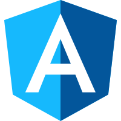

# 概述：平台

Dart是一种可伸缩的语言，可用于编写简单的脚本或全功能的应用程序。无论您是创建移动应用程序，Web应用程序，命令行脚本还是服务器端应用程序，都可以使用Dart解决方案。

- [Flutter](https://flutter.io/) 编写一个可在iOS和Android上运行的移动应用程序。

- [Web](https://webdev.dartlang.org/) 编写可在任何现代Web浏览器中运行的应用程序。

- [Server](/server/) 编写命令行应用程序或服务器端应用程序。