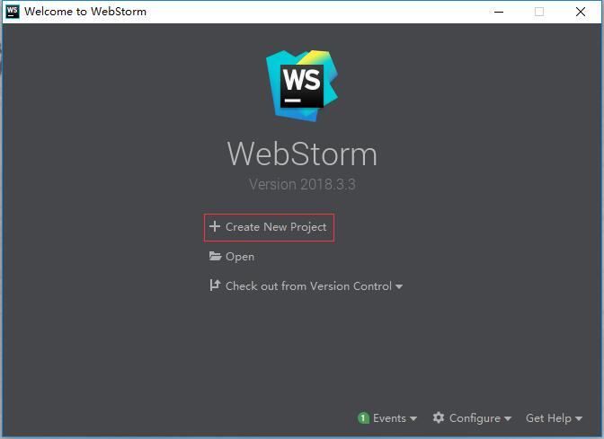
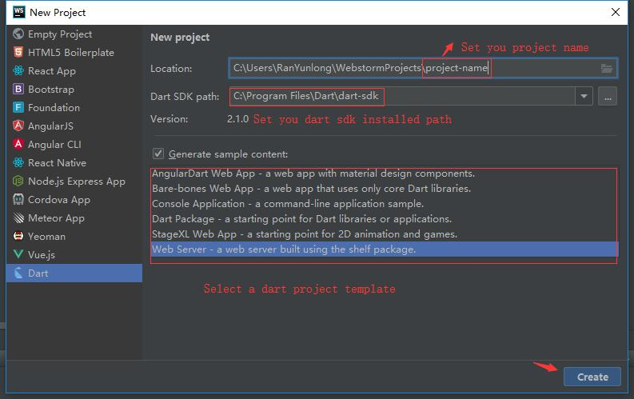

# Tools

When you’re ready to create an app, get the SDK and tools for your app type.

App type|Get started instructions|Tool information
--|--|--
Mobile|[Install Flutter](https://flutter.io/)|[Flutter tools](https://flutter.io/docs/development/tools/android-studio)
Web|[Install the Dart SDK](/zh/guide/install)| Dart tools for the web
Script or server|[Install the Dart SDK](/zh/guide/install)| Tools for server-side development

Dart plugins exist for these commonly used IDEs.

1. [Android Studio](http://www.android-studio.org/) flutter
2. [Visual Studio code](https://code.visualstudio.com/)
3. [Webstorm](http://www.jetbrains.com/webstorm/)

## DartPad

[DartPad](https://dartpad.dartlang.org/) is a great, no-download-required way to learn Dart syntax and to experiment with Dart language features. It supports Dart’s core libraries, except for VM libraries such as dart:io.

## vscode

[Visual Studio code for Dart](https://marketplace.visualstudio.com/items?itemName=Dart-Code.dart-code)

## Webstorm

###  Create project

### Set dart sdk

## Tools in SDKs
Most Dart-related SDKs include the following tools:

### [Pub package manager (pub)](/guide/pub/)

Manages Dart packages, making it easy for you to install, use, and share Dart libraries, command-line tools, and other assets. Some Dart technologies, such as Flutter, may not support all of the pub commands. IDEs that support Dart generally have special support for pub, but you can also use it from the command line.

### Static analyzer (dartanalyzer)
Evaluates and reports any errors or warnings in your code. The Dart plugin for your IDE should make use of Dart’s analysis engine, but you can also run the analyzer from the command line.
### 代码格式化工具 (dartfmt)
Formats your code, following the recommendations of the Dart Style Guide. IDEs that support Dart generally allow you to format the code within the IDE. Or you can run the formatter from the command line.

## Tools in packages

The following tools are distributed in packages on the Dart package site. To install them, use the pub command, as described in each tool’s installation instructions.

### build_runner
A code generator.
### dartfix
A tool for migrating Dart source code and fixing common issues.