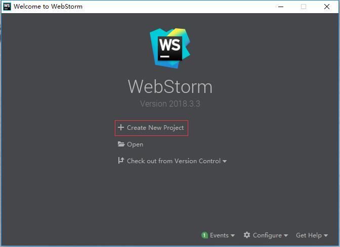
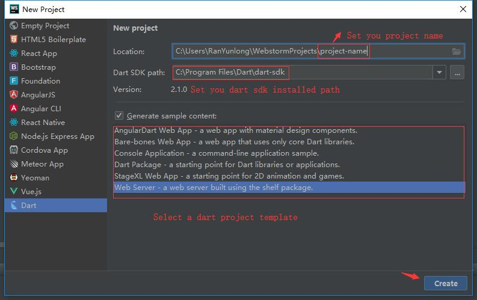

# 开发工具

在你准备好创建一个应用程序时， 请获对应于应用类型的SDK和工具。

应用类型|使用说明|工具信息
--|--|--
移动端|[安装 Flutter](https://flutter.io/)|[Flutter 工具](https://flutter.io/docs/development/tools/android-studio)
Web|[安装 Dart SDK](/zh/guide/install)| Dart Web 端工具
脚本或服务器|[安装 Dart SDK](/zh/guide/install)| 服务端开发工具

dart 支持以下IDE：

1. [Android Studio](http://www.android-studio.org/) flutter 开发推荐使用
2. [Visual Studio code](https://code.visualstudio.com/) web或服务器开发推荐使用
3. [Webstorm](http://www.jetbrains.com/webstorm/) web或服务器开发推荐使用

在web或服务器开发中 [Webstorm](http://www.jetbrains.com/webstorm/) 支持更全面一些。

## DartPad

[DartPad](https://dartpad.cn/) 无需下载，是一个在线学习Dart 语法和体验 Dart 语言功能的在线工具，它只支持 Dart 的核心库，但不能使用 VM 库，例如 dart:io。

## vscode配置

### 创建项目
1. 在[Visual Studio code](https://code.visualstudio.com/)扩展中搜索 dart相关的插件，并且安装。使用ctrl + shift + x 可以打开扩展
2. 直接安装点击链接[Visual Studio code for Dart](https://marketplace.visualstudio.com/items?itemName=Dart-Code.dart-code)，在打开的网页中，点击install 并安装依赖（建议使用chrome 浏览器打开）

## Webstorm配置

###  创建项目

### 设置dart sdk

1. 添加项目名称
2. 设置dart sdk的path
3. 选项开发模板

:::warning 注意
Webstorm 必须添加dart sdk的安装目录，如果不添加就无法创建项目
:::